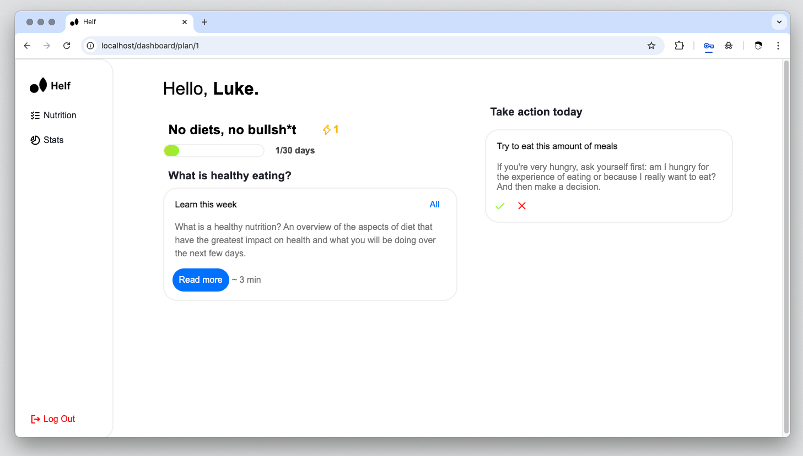
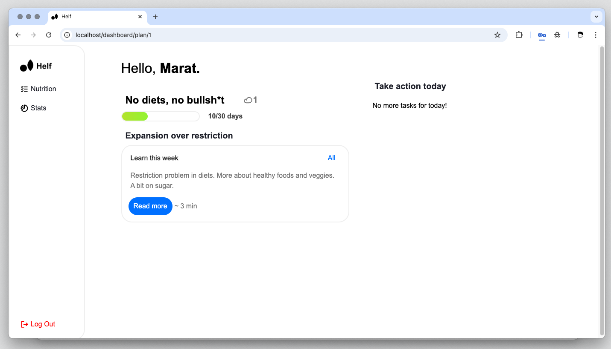
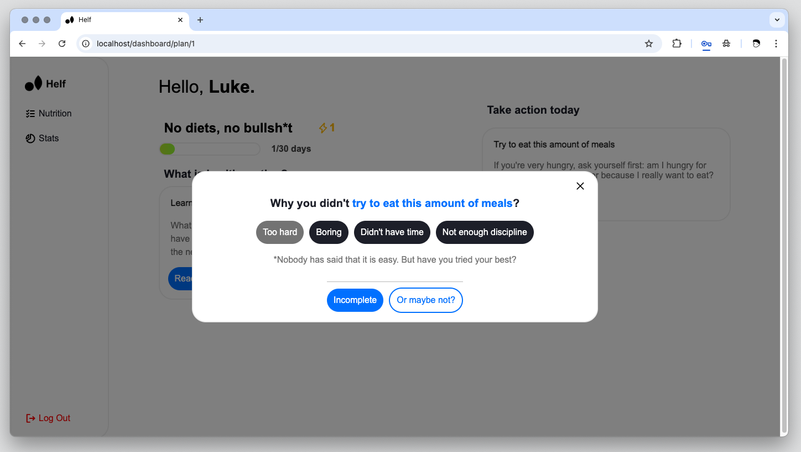
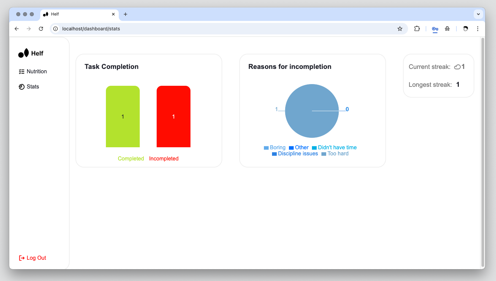
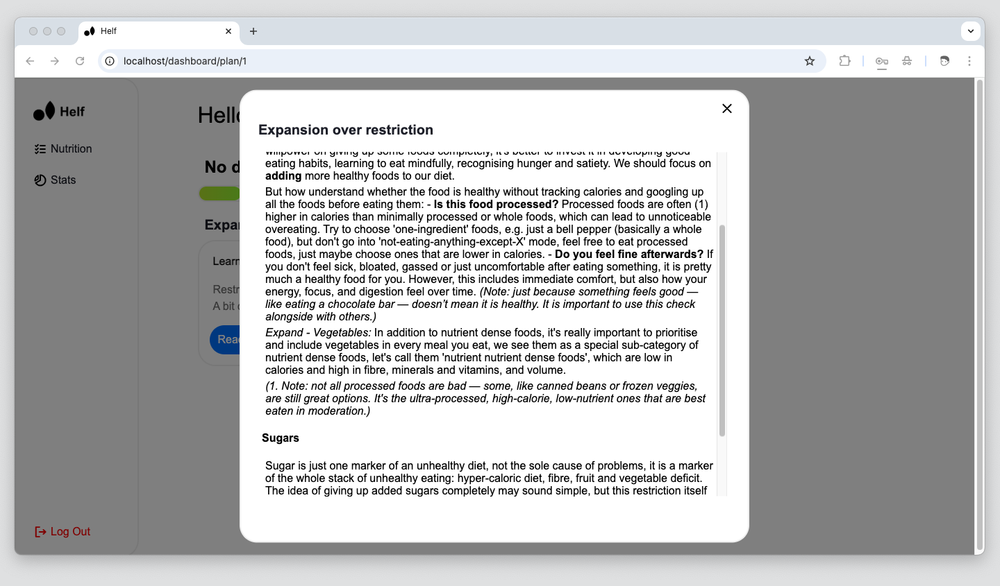

# Helf
Helf helps individuals build healthier habits and improve their health without stress. It provides science-based, clear, and simple plans and actionable information through a free web app.
### Features
- **Daily Tasks:** Users receive daily tasks to improve their health.
- **Blocks of Information:** Less frequent "blocks" of information that users can learn and apply to their daily tasks.
- **Stats Tracking:**
    - Streak: Tracks how many days in a row a user has completed at least one task.
    - Task Completion: Shows how many tasks the user has completed and how many he didn't.
    - Longest Streak: Displays the user's longest streak of task completion.
    - Reasons for Incompletion: Records the reasons users give for not completing tasks.
- **Reflections:** After not completing a task, the app asks users why they didn’t complete it and saves their responses for future review.
### What Makes Helf Unique
Helf uses stress-free and practical methods for improving health. The plans are simple and easy to follow, so users don’t feel overwhelmed. Helf aims to make health improvement feel natural, rather than a second job.
### Platform & Access
- **Platform:** Web App (server-hosted)
- **Status:** Currently in development
- **Access:** Available via a web browser (URL to be added upon release)
- **Sign-Up:** Required. Users must create a free account using their email address.
- **No Installation Required:** Runs directly in the browser with no download needed.
- **Dependencies:** None for the end user. Just a modern web browser and internet access.
### How It Works
Upon release, Helf will offer a single plan. The main flow after signing up will be as follows:
1. Start the plan.
2. Read the first informational block.
3. Complete daily tasks.
4. View stats and progress.
### Demos

**Sign up form**

**Start the plan page:** this show after signing up

**Tasks:** one completed task on the day 1 and an active streak

User has completed all the tasks and streak isn't active

**Incompletion**: if user clicks red cross on the task, it shows him this reflection, by default the reason is "Other".
!
**Stats:** 'Task Completion' refers to the number of tasks the user has completed and didn't (clicked the red cross or skipped them).

**Reading block:** when a user clicks "Read more" a reader pops up with information relevant to his day.
### Development & Contribution
Helf is currently being developed by a solo developer. It is a small personal project, the initial idea being to develop something meaningful while practising coding, which could potentially help real people. I chose health improvement because I have personally struggled with it; nutrition was chosen as the first plan, as it is the field where people get confused and struggle the most.

The project is currently in the development phase and is not yet open to public contributions. However, feedback, suggestions and ideas are welcomed.

***License information** will be added before public release.*
